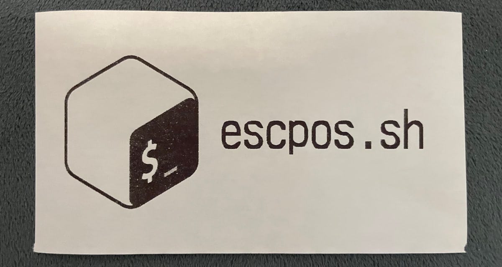

# escpos.sh

A Bash ESCPOS library.



## Simple Usage

For simplicity, this library is a collection of bash functions that write to
standard out. Pipe the data directly to your printer.

```bash
# USB Printer Example
(
  source "./escpos.sh"
  escpos_reset
  escpos_justify --center
  escpos_text_size 2
  echo "A centered line of text"
  ...
  escpos_cut
) > /dev/usb/lp0

# Networked Printer Example
(
  source "./escpos.sh"
  escpos_reset
  escpos_justify --center
  escpos_text_size 2
  echo "A centered line of text"
  ...
  escpos_cut
) | nc 10.0.0.2 9100
```

## Installation

1. Grab
   [`escpos.sh`](https://github.com/michaelkitson/escpos.sh/releases/latest/download/escpos.sh)
   from the
   [latest Github release](https://github.com/michaelkitson/escpos.sh/releases/latest).
2. Place it anywhere and source it with a absolute/relative path
   (`source ./escpos.sh`) in your script, or place it in your path and source it
   by name alone (`source escpos.sh`).

Requirements: Bash (3+), coreutils (really just base64 and tail).

## Examples

See the [examples directory](./examples). Pipe stdout from the example into your
printer, like `./examples/epson.sh | nc 10.0.0.2 9100`

## Testing

All functions should have test coverage. Tests are written using
[bats](https://github.com/bats-core/bats-core).

Run `make test` to run them all.

I've performed some ad-hoc testing on the real device I have convenient, an
Epson TM-T20.

## Building

Running `make` (or `make escpos.sh`) will build the amalgamated library.
